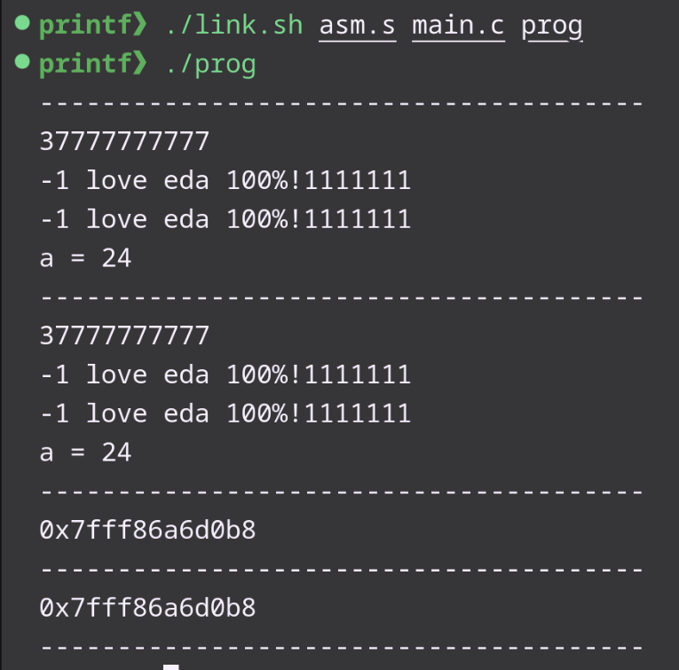

# my_printf

Func realized on Nasm x86_64. My function is identical to the standard function **printf** (C).

## Program start

``` 
    ./link.sh <program.s> <program.c> <program> 
    ./<program> 
```
### For example

```
    ./link.sh asm.s main.c prog
    ./prog
```
## Description
The my_printf() function writes to stdout the arguments from the arg-list under the control of the string pointed to by the format argument.

The my_printf() function returns the number of characters actually printed. Returning a negative value indicates an error.

The function is implemented in such a way that the minimum buffer size should be 32 bits for maximum performance.
## Implemented functionality

| specifier | functional |
| :--------:| :--------: |
| %s        | input str  |
| %d        | input decimal number |
| %b        | input binary number |
| %o        | input octal number |
| %x        | input hexadecimal number |
| %c        | input one char symbol |
| %p        | input address pointer |
| %n        | passing number printed smb |

## Comparing my function and the original one (main.c)



